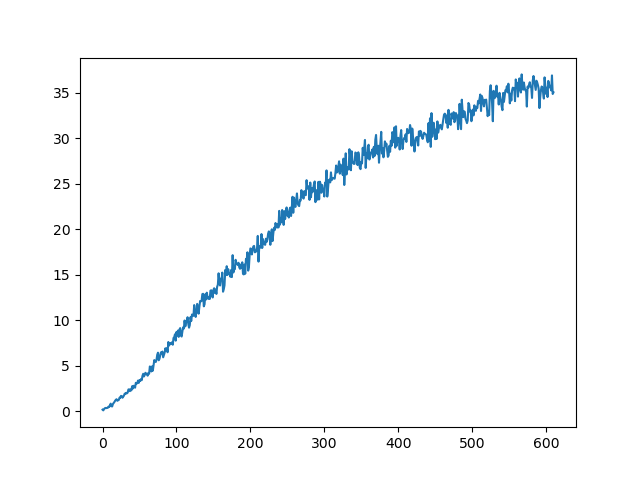
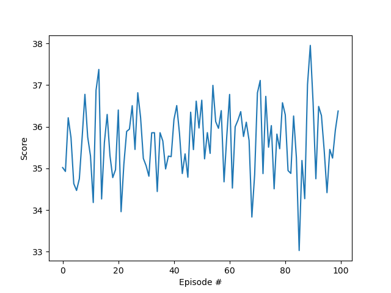

# Project Report
This document is my report for the 20-agent Reacher project.

# Learning Algorithm
The learning algorithm is an adaptation of Proximal Policy Optimization (PPO), based on the Udacity course code for the Pong environment.  PPO is a policy-based deep reinforcement learning algorithm.  Essentially, it replaces the objective function for a vanilla policy gradient algorithm such as REINFORCE with a clever "clipped surrogate function."  The point of the clipping is to reduce big steps during optimization, in order to improve stability while training.  The improved stability from clipping allows PPO to perform multiple epochs of gradient ascent on trajectory samples.

For this implementation, the neural network architecture chosen contains the following PyTorch layers, coded in **ReacherPolicy.py**:
* A Linear layer with input size 33 (to match state space) and output size 128
* A Linear layer with input size 128 and output size 64
* A Linear layer with input size 64 and output size 32
* A Linear layer with input size 32 and output size 4 (to match action space)

The neural network is designed to sample its actions for each timestep from 4 normal distributions, one for each action.  The 4 outputs of the neural network are the means used for the normal distributions.  The standard deviations are coded as PyTorch neural network parameters to be optimized during training.  My early attempts in this project included the standard deviations as outputs from the neural network.  However, this was found to not work well, because sometimes the network will output zero for standard deviations, which causes log probabilities to be zero, causing numerical issues.

Hyperparameters used in the project are described below:
* learning_rate: the learning rate used during training
* num_episodes: the maximum number of episodes to run during training
* discount: the discount coefficient for future rewards
* epsilon: the episilon clipping variable, used in the PPO "clipped surrogate" objective function
* beta: the entropy coefficient used in PPO
* batch size: the batch size that is used during training
* num_epochs_per_episode: the number of training epochs to run after each episode playout

# Reward Plots
The agent solved the environment in 510 episodes.  A plot of the training rewards is shown below.

For further validation, the trained agent was run through the environment for an additional 100 episodes, achieving an average score of 35.64.  A plot of the validation rewards is shown below.

# Ideas for Future Work
In this implementation, I used a purely policy-based PPO algorithm.  Because it samples randomly from normal distributions for its actions, there is some degree of randomness in the training process, which can be seen by re-running training (without constraining the random generator seeds).  Putting the PPO algorithm into the policy-based slot of an actor-critic architecture could reduce the variance associated with the purely policy-based model used here by having a value-based Critic network learn the value of actions.

In addition, sample efficiency of the algorithm could be improved by introducing an experience replay buffer, similar to the technique from Deep Q-Learning.  By saving and sampling from more of the agent's prior experiences, it is likely that training could be accomplished with fewer overall episodes.  An algorithm that combines several of these ideas, such as Actor-Critic with Experience Replay, could work well for overall improvement with this environment.

